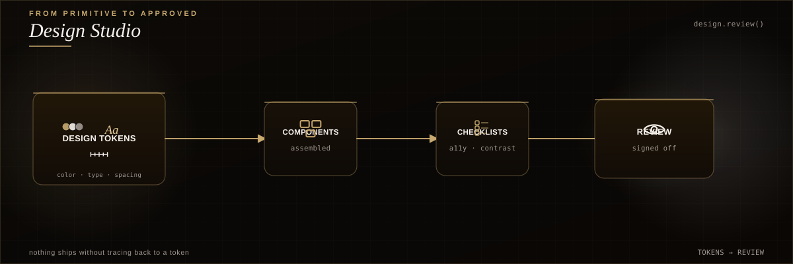
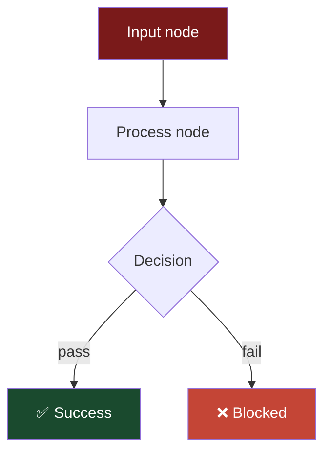

# RIG Design System — Complete Reference

> **The standard for every page, repo, and surface under mrodgersjs-web.**
> Use this to model new pages. Every element here was battle-tested across 30 repos, 26 architecture diagrams, 10 hero images, and a live production site.

---

## 1. Design Philosophy

```
Omission over completeness · Numbers over adjectives · Gold sparingly · Whitespace is luxury
```

Three rules that govern every decision:
1. **Show less, make each element count** — a visitor scans in 15 seconds, not reads
2. **Every claim has evidence** — no source → no number → it doesn't go on the page
3. **The design serves the proof** — visuals exist to make the evidence undeniable

---

## 2. Color System

### Primary palette
| Token | Hex | Usage |
|---|---|---|
| `--noir` | `#0A0806` | Root background (warm noir, NOT pure black) |
| `--noir-lift` | `#12100C` | Card/panel background |
| `--noir-float` | `#1A1712` | Hover/elevated state |
| `--gold` | `#C8A96E` | Primary accent — use SPARINGLY (max 15% of visible area) |
| `--gold-light` | `#D4BC8B` | Hover/active gold |
| `--gold-subtle` | `rgba(200,169,110,.14)` | Tinted backgrounds, subtle highlights |
| `--gold-hair` | `rgba(200,169,110,.22)` | Hairline borders, dividers |
| `--gold-glow` | `rgba(200,169,110,.28)` | Glow effects behind key elements |

### Text hierarchy
| Token | Hex | Usage |
|---|---|---|
| `--warm-white` | `#F5F0EB` | Primary text (warm, not pure white) |
| `--stone` | `#A09890` | Secondary text, descriptions |
| `--charcoal` | `#6A6258` | Tertiary text, metadata, captions |

### Semantic
| Token | Hex | Usage |
|---|---|---|
| `--moss` | `#5B8C5A` | Success, passing tests, verified |
| `--red` | `#C44536` | Failure, blocked, danger |
| `--sage` | `#7C9482` | Approved states (SVG diagrams) |
| `--rust` | `#9A5A48` | Blocked states (SVG diagrams) |

### CSS variable block (copy this into every project)
```css
:root {
  --noir:#0A0806; --noir-lift:#12100C; --noir-float:#1A1712;
  --gold:#C8A96E; --gold-light:#D4BC8B;
  --gold-subtle:rgba(200,169,110,.14); --gold-hair:rgba(200,169,110,.22); --gold-glow:rgba(200,169,110,.28);
  --warm-white:#F5F0EB; --stone:#A09890; --charcoal:#6A6258;
  --red:#C44536; --moss:#5B8C5A;
  --serif:"Cormorant Garamond",Georgia,serif;
  --sans:"Hanken Grotesk",system-ui,-apple-system,sans-serif;
  --mono:"JetBrains Mono",ui-monospace,monospace;
  --ease:cubic-bezier(.16,1,.3,1);
  --ease-io:cubic-bezier(.65,0,.35,1);
  --space-section:clamp(4.5rem,3rem+6vw,11rem);
}
```

---

## 3. Typography

### Font stack
| Role | Font | Weights | Usage |
|---|---|---|---|
| **Serif** | Cormorant Garamond | 400, 500, 600, italic | Headlines, editorial taglines, emotional moments |
| **Sans** | Hanken Grotesk | 300, 400, 500, 600, 700 | Body text, UI labels, navigation |
| **Mono** | JetBrains Mono | 400, 500 | Code, technical values, metadata, numbers |

### Google Fonts link
```html
<link href="https://fonts.googleapis.com/css2?family=Cormorant+Garamond:ital,wght@0,400;0,500;0,600;1,400;1,500&family=Hanken+Grotesk:wght@300;400;500;600;700;800&family=JetBrains+Mono:wght@400;500;700&display=swap" rel="stylesheet">
```

### Typographic scale
| Element | Font | Size | Weight | Letter-spacing |
|---|---|---|---|---|
| H1 (hero) | Cormorant Garamond | `clamp(2rem, 5vw, 3.5rem)` | 500 | -0.02em |
| H2 (section) | Cormorant Garamond | `clamp(1.5rem, 3vw, 2rem)` | 500 | -0.01em |
| H3 (card) | Cormorant Garamond | 1.3rem | 500 | 0 |
| Body | Hanken Grotesk | 0.95rem | 400 | 0 |
| Small/label | Hanken Grotesk | 0.85rem | 500 | 0.02em |
| Code/value | JetBrains Mono | 0.8rem | 400 | 0 |
| Eyebrow | JetBrains Mono | 0.7rem | 500 | 0.1em, uppercase |

### Typographic patterns
- **Gold italic emphasis**: `<em>` in serif headlines uses `color:var(--gold); font-style:italic`
- **Editorial taglines**: serif italic, centered, stone color, under hero
- **Eyebrow labels**: mono, uppercase, gold, above section titles
- **Numbers always mono**: test counts, metrics, version numbers → JetBrains Mono

---

## 4. Layout Patterns

### 4.1 The README Skeleton (GitHub standard)

Every repo README follows this exact structure:

```markdown
<div align="center">
  -hero.png" width="100%" />
</div>

<br/>

<div align="center">
  <h3>REPO_NAME</h3>
  <p><em>One-line editorial tagline</em></p>
</div>

<div align="center">
  <!-- Badge row: status, tests, license, language, MIT -->
</div>

<br/>

---

> 🥇 **Single sharpest insight about this repo** (gold-emoji blockquote)

---

## 60-second install
<!-- Code block — the FIRST real content -->

## How it works

<!-- One-line caption in <sub> -->

## Benchmark / Results
<!-- Table with real numbers -->

## Why it exists
<!-- 3-4 concise bullets -->

<details>
<summary>Extended documentation</summary>
<!-- All secondary content here — keeps the scroll clean -->
</details>

---

<div align="center">
<sub>Built by Mike Rodgers · Forward Deployed Engineer · <a href="https://rodgersintelligence.com">rodgersintelligence.com</a></sub>
</div>
```

### 4.2 The Website Page Skeleton (rodgersintelligence.com standard)

```html
<!-- Chaptered scroll structure (used on hire-mike, meet pages) -->
<section data-cs-chapter="1" id="hero">
  <!-- Hero with portrait + tagline + CTAs -->
</section>

<section data-cs-chapter="2" id="stats">
  <!-- Stat grid: production system scale -->
</section>

<section data-cs-chapter="3" id="timeline">
  <!-- Career trajectory or methodology -->
</section>

<!-- Chaptered-scroll.js auto-discovers chapters via [data-cs-chapter] -->
```

### 4.3 Stat Grid Component

Used on hire-mike, meet, and profile README:

```css
.stat-grid {
  display: grid;
  grid-template-columns: repeat(4, 1fr);
  gap: 1rem;
}
.stat-grid .s {
  background: var(--noir-lift);
  border: 1px solid var(--gold-hair);
  border-radius: 8px;
  padding: 1.5rem;
  text-align: center;
}
.stat-grid .s b {
  font-family: var(--serif);
  font-size: 2rem;
  color: var(--gold);
  display: block;
}
.stat-grid .s span {
  font-family: var(--mono);
  font-size: 0.7rem;
  color: var(--stone);
  text-transform: uppercase;
  letter-spacing: 0.05em;
}

/* Responsive */
@media (max-width: 900px) { .stat-grid { grid-template-columns: repeat(2, 1fr); } }
@media (max-width: 560px) { .stat-grid { grid-template-columns: 1fr; } }
```

### 4.4 Tech Stack Chip Row

```css
.tech-row {
  display: flex;
  flex-wrap: wrap;
  gap: 0.5rem;
  justify-content: center;
}
.tech-chip {
  background: var(--gold-subtle);
  color: var(--gold);
  font-family: var(--mono);
  font-size: 0.75rem;
  padding: 0.25rem 0.75rem;
  border-radius: 4px;
  letter-spacing: 0.03em;
}
```

### 4.5 Badge Row (shields.io)

Standard badges with consistent palette:
```markdown


```

For branded badges (design system colors):
```
https://img.shields.io/badge/LABEL-VALUE?style=flat-square&labelColor=0A0806&color=C8A96E
```

---

## 5. SVG Architecture Diagram Standard

Every diagram follows these rules (26 diagrams shipped):

### Structure
- **Canvas**: 1200×400 viewBox
- **Background**: `#0A0806` with subtle grid texture or radial glow
- **Nodes**: Rounded rectangles (`rx=8`), 2px gold strokes, dark fill
- **Connectors**: Cubic-bezier curved paths (not straight lines), gold arrows
- **Glow**: `feGaussianBlur` behind key nodes (subtle, 4-8px radius)
- **Typography**: Cormorant Garamond italic for titles, Hanken Grotesk for labels, JetBrains Mono for values
- **Consistent header**: eyebrow + title + underline + tag
- **Consistent footer**: caption left, meta right, gold hairline

### Arrow marker definition
```xml
<defs>
  <marker id="arrow-gold" markerWidth="10" markerHeight="10" refX="8" refY="3" orient="auto">
    <path d="M0,0 L8,3 L0,6 Z" fill="#C8A96E"/>
  </marker>
  <marker id="arrow-stone" markerWidth="10" markerHeight="10" refX="8" refY="3" orient="auto">
    <path d="M0,0 L8,3 L0,6 Z" fill="#A09890"/>
  </marker>
</defs>
```

### Color usage in diagrams
- **Gold** (`#C8A96E`): primary flow, active path, key nodes
- **Sage** (`#7C9482`): approved/success outcomes
- **Rust** (`#9A5A48`): blocked/failure outcomes
- **Stone** (`#A09890`): secondary paths, labels
- **Cream** (`#F5F0EB`): primary text

---

## 6. Higgsfield Image Standard

### Hero image prompt template
```
Dark noir premium visualization. [CONCEPT DESCRIPTION].
Gold (#C8A96E) accents on warm noir (#0A0806) background.
Minimal, cinematic, Apple keynote quality. Generous negative space.
No text. Film grain. Depth of field. Gallery-grade.
```

### Generation parameters
| Parameter | Value |
|---|---|
| Model | `nano_banana_2` (2 credits) or `gpt_image_2` (7 credits, higher quality) |
| Aspect ratio | `16:9` (repos), `3:1` (profile banner) |
| Quality | `high` |
| Resolution | `4k` (for gpt_image_2) or default (nano_banana_2: 2752×1536) |

### Post-processing
- Resize to 2400px wide for web (saves bandwidth)
- Convert to JPEG quality 92 for push (PNG → JPEG reduces 10MB → 0.6MB)
- Push to `assets/<repo>-hero.png` (keep .png extension for compatibility)

---

## 7. Mermaid Diagram Standard

Used in profile READMEs (GitHub renders natively):



### Rules
- Always use `graph TD` (top-down) or `graph LR` (left-right)
- Style key nodes with fill colors matching the palette
- Use emoji in node labels for instant scanability
- Keep to max 6-7 nodes — more = unreadable on mobile

---

## 8. Motion / Animation Standard

### CSS transitions
```css
 transition: all 0.3s var(--ease); /* standard */
 transition: border-color 0.2s var(--ease); /* hover states */
```

### Easing functions
| Name | Value | Usage |
|---|---|---|
| `--ease` | `cubic-bezier(.16,1,.3,1)` | Default — smooth deceleration |
| `--ease-io` | `cubic-bezier(.65,0,.35,1)` | In-out — symmetric |

### Hover patterns
- **Cards**: `border-color` shifts from `gold-hair` to `gold` on hover
- **Buttons**: `translateY(-1px)` + background lightens
- **Links**: color shifts to gold

### Cinematic video standard (HyperFrames)
- 15 seconds, 3 acts (5s each)
- Act 1: Problem (dark, text fades in with tracking animation)
- Act 2: Solution (architecture nodes pop in sequentially, connectors draw)
- Act 3: Install (code types out, CTA fades in)
- 0.5s fade-to-black between acts
- Persistent corner brackets + watermark + progress bar

---

## 9. Component Library

### 9.1 Card Component
```css
.card {
  background: var(--noir-lift);
  border: 1px solid var(--gold-hair);
  border-radius: 12px;
  padding: 2rem;
  transition: border-color 0.3s var(--ease);
}
.card:hover { border-color: var(--gold); }
```

### 9.2 Button System
```css
.btn {
  padding: 0.875rem 2rem;
  border: none;
  border-radius: 8px;
  font-family: var(--sans);
  font-weight: 600;
  cursor: pointer;
  transition: all 0.2s var(--ease);
}
.btn-primary { background: var(--gold); color: var(--noir); }
.btn-primary:hover { background: var(--gold-light); transform: translateY(-1px); }
.btn-ghost { background: transparent; color: var(--stone); border: 1px solid var(--gold-hair); }
.btn-ghost:hover { border-color: var(--gold); color: var(--gold); }
```

### 9.3 Gold-Eyebrow Section Header
```css
.eyebrow {
  font-family: var(--mono);
  font-size: 0.75rem;
  color: var(--gold);
  text-transform: uppercase;
  letter-spacing: 0.1em;
  margin-bottom: 0.5rem;
}
.section-title {
  font-family: var(--serif);
  font-size: clamp(1.5rem, 3vw, 2rem);
  font-weight: 500;
}
.section-title em { color: var(--gold); font-style: italic; }
```

### 9.4 Star Rating (feedback pages)
```css
.stars { display: flex; gap: 0.25rem; }
.star { font-size: 1.5rem; color: var(--charcoal); cursor: pointer; transition: color 0.15s; }
.star.active, .star:hover { color: var(--gold); }
```

### 9.5 Toast Notification
```css
.toast {
  position: fixed; bottom: 2rem; left: 50%;
  transform: translateX(-50%) translateY(100px);
  background: var(--moss); color: white;
  padding: 1rem 2rem; border-radius: 8px;
  transition: transform 0.3s var(--ease); z-index: 100;
}
.toast.show { transform: translateX(-50%) translateY(0); }
```

### 9.6 Collapsible Details
Standard GitHub `<details>` — used to keep the primary scroll clean:
```html
<details>
<summary><b>Extended documentation</b></summary>
<!-- Secondary content here -->
</details>
```

### 9.7 Divider
```css
.divider {
  height: 1px;
  background: linear-gradient(90deg, transparent, rgba(200,169,110,.2), transparent);
  margin: 3rem 0;
}
```

---

## 10. SEO Standard

### Repo description format
```
[What it does] — [key feature]. [Keywords recruiters/developers search]. [Role positioning].
```
Example: `Catch AI agents when they lie about done — HMAC-signed ProofPackets. Forward Deployed Engineer tool for governed AI production.`

### Topic tags (applied to every repo)
```
ai-agents, forward-deployed-engineer, llm, agent-governance, proof-gates, evals, mlops
```
Plus repo-specific topics (e.g., `bdd`, `tac`, `deviation-engines`, `prompt-engineering`).

### OG image
Every repo should have `assets/og-image.svg` (1200×630) for social sharing.

---

## 11. File Structure Standard

### Repo layout
```
repo-name/
├── README.md              # World-class, follows the skeleton
├── LICENSE                # MIT
├── CONTRIBUTING.md        # How to contribute
├── assets/
│   ├── <repo>-hero.png    # Higgsfield-generated hero
│   ├── architecture.svg   # Designer-quality diagram
│   └── demo.html          # HyperFrames video composition (if applicable)
├── src/ or rig_<name>/    # Source code
├── tests/                 # Test suite
├── spec/features/         # OpenSpec BDD (if applicable)
├── .rig/
│   ├── smoke.sh           # L10 self-evolving test
│   └── verify.sh          # L8 8-layer verification
└── pyproject.toml         # or package.json (pip/npm installable)
```

---

## 12. Quality Checklist

Before any page/repo ships:

- [ ] Hero image (higgsfield-generated, NOIR/gold, no text or minimal)
- [ ] Architecture diagram (SVG, designer-quality, data flow visible)
- [ ] README follows the skeleton (hero → badge → install → diagram → benchmark → why → details → footer)
- [ ] SEO description (keywords + role positioning)
- [ ] 7+ topic tags applied
- [ ] All text uses the typography stack (serif/sans/mono)
- [ ] Colors use only the palette tokens (no random hex values)
- [ ] Responsive (works at 560px, 900px, 1200px+)
- [ ] Every number is sourced or labeled as estimate
- [ ] Gold used sparingly (max 15% of visible area)
- [ ] Collapsible details for secondary content (clean primary scroll)

---

*This design system was developed across 30 repos, 26 architecture diagrams, 20+ higgsfield images, 5 cinematic videos, and a live production website. It is the single source of truth for every visual decision under mrodgersjs-web.*
